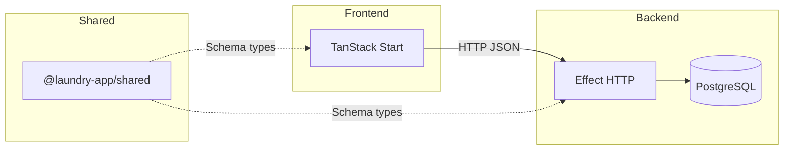
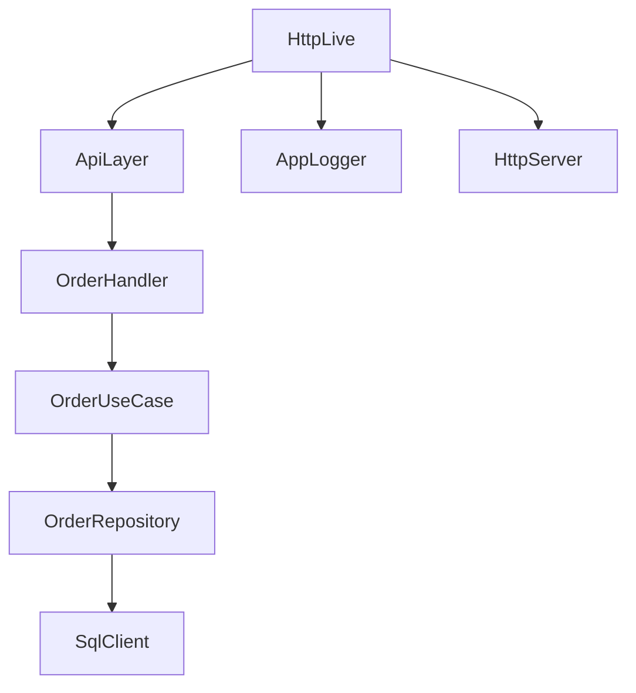
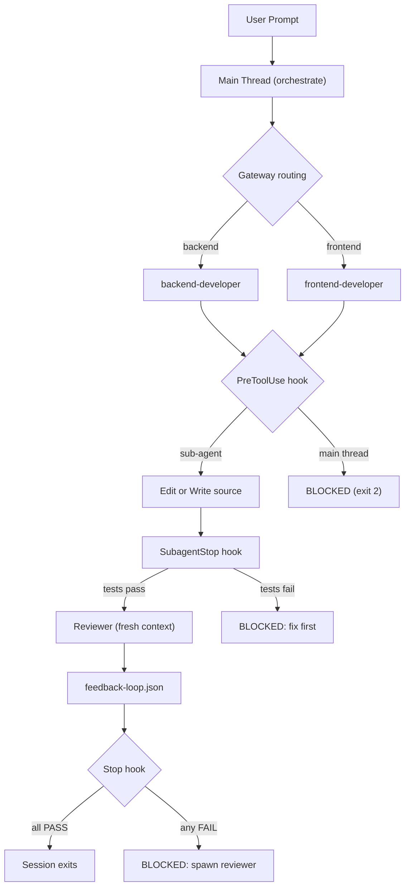

# What This Talk Is About

<!-- incremental_lists: true -->

- **The stack** — Effect-TS on the backend, TanStack Start on the frontend
- **The case study** — a real laundry management app built end-to-end with this stack
- **The punchline** — how AI agents shipped the code, constrained by deterministic hooks

> _A practical tour of two underrated TypeScript frameworks — and the workflow that kept things honest_

<!-- end_slide -->

## Part 1: The Case Study

<!-- end_slide -->

# The App: Laundry Manager

A web-only laundry management system for small businesses.

| Domain    | What it covers                                       |
| --------- | ---------------------------------------------------- |
| Customers | Registration, profiles, history                      |
| Orders    | Walk-in → received → in_progress → ready → delivered |
| Services  | Pricing, units (kg, pcs, set)                        |
| Payments  | Per-order tracking (paid / unpaid)                   |
| Analytics | Weekly summaries, dashboard stats                    |

Built as a **Bun workspace monorepo** with a shared package bridging frontend and backend.

<!-- end_slide -->

# System Architecture



<!-- end_slide -->

# Repo Layout

```
laundry-app/
├── packages/shared/src/      # DTOs, branded IDs, enums — used by both sides
│   ├── order.ts
│   ├── customer.ts
│   └── ...
│
├── backend/src/
│   ├── api/          # HttpApi route definitions (typed I/O)
│   ├── handlers/     # Route handler implementations
│   ├── usecase/      # Business logic  (Effect.Service)
│   ├── repositories/ # SQL queries     (no ORM, explicit columns)
│   └── domain/       # Error types     (Data.TaggedError)
│
└── frontend/src/
    ├── routes/       # TanStack Router file-based routes
    ├── api/          # Query hooks + API client
    └── components/   # React UI (shadcn/ui + Tailwind v4)
```

<!-- end_slide -->

## Part 2: Effect-TS Backend

<!-- end_slide -->

# Why Effect?

<!-- incremental_lists: true -->

**The problem with async/await + try/catch:**

- Errors disappear into `unknown` — no compile-time proof you handled them
- Dependencies sneak in via imports — hidden coupling, hard to test
- Async code composes awkwardly — no structured concurrency built in

**What Effect gives you:**

- Errors are part of the type: `Effect<Value, Error, Dependencies>`
- Dependencies declared explicitly — the compiler knows what each service needs
- A composable runtime — services wire up via Layers, swappable in tests

<!-- end_slide -->

# Effect.Service Pattern

`backend/src/usecase/customer/CreateCustomerUseCase.ts`

```typescript
export const createCustomerUseCaseImpl = Effect.gen(function* () {
  const repo = yield* CustomerRepository

  const execute = Effect.fn('CreateCustomerUseCase.execute')(function* (data: CreateCustomerInput) {
    const phone = yield* normalizePhoneNumber(data.phone)
    const existing = yield* repo.findByPhone(phone)
    if (Option.isSome(existing)) {
      return yield* Effect.fail(new CustomerAlreadyExists({ phone }))
    }
    return yield* repo.insert(
      Customer.insert.make({ name: data.name, phone, address: data.address || null })
    )
  })
  return { execute } as const
})

export class CreateCustomerUseCase extends Effect.Service<CreateCustomerUseCase>()(
  'CreateCustomerUseCase',
  { accessors: true, effect: createCustomerUseCaseImpl, dependencies: [CustomerRepository.Default] }
) {}
```

<!-- end_slide -->

# Typed Errors

`backend/src/domain/OrderErrors.ts`

```typescript
import { Data } from 'effect'

export class OrderNotFound extends Data.TaggedError('OrderNotFound')<{
  orderId: string
}> {}

export class InvalidOrderStatus extends Data.TaggedError('InvalidOrderStatus')<{
  currentStatus: string
  attemptedStatus: string
  reason: string
}> {}

export class InvalidOrderTransition extends Data.TaggedError('InvalidOrderTransition')<{
  from: string
  to: string
}> {}
```

Errors are **values**, not throw sites.
TypeScript tracks every possible failure in the `E` channel — miss one, the compiler tells you.

<!-- end_slide -->

# Layer Composition

How services wire into the runtime:



Each arrow is a `Layer.provide`. The compiler enforces the full dependency graph — missing a layer is a compile error, not a runtime crash.

<!-- end_slide -->

# Layer Composition — Code

`backend/src/main.ts`

```typescript
const HttpLive = HttpApiBuilder.serve(RequestLoggingMiddleware).pipe(
  Layer.provide(ScalarLayer),
  Layer.provide(CorsLayer),
  Layer.provide(ApiLayer),
  Layer.provide(AppLogger.Default),
  HttpServer.withLogAddress,
  Layer.provide(HttpServerLive),
  Layer.provide(SqlClientLive)
)
```

One pipe chain wires the entire HTTP server.
Swap any layer for a test double — the app composes the same way.

<!-- end_slide -->

# HttpApi Route Definition

`backend/src/api/OrderApi.ts`

```typescript
.add(
  HttpApiEndpoint.put('updateStatus', '/api/orders/:id/status')
    .setPath(OrderIdParam)
    .setPayload(UpdateOrderStatusInput)
    .addSuccess(OrderResponse)
    .addError(OrderNotFound)
    .addError(InvalidOrderStatus)
    .addError(OrderPaymentRequired)
    .addError(ValidationError)
    .addError(UnprocessibleEntity)
)
```

Route contract in one place: path, payload, success shape, and **every typed error**.
The handler that doesn't handle `OrderNotFound` will not compile.

<!-- end_slide -->

# Request Lifecycle

```
  Client
    │
    ▼
┌─────────────────────┐
│      HttpApi        │  typed route contract (path · payload · errors)
└──────────┬──────────┘
           │
┌──────────▼──────────┐
│   Auth Middleware   │  JWT verification  (Effect layer, composable)
└──────────┬──────────┘
           │
┌──────────▼──────────┐
│      Handler        │  thin — calls usecase, maps errors → HTTP status
└──────────┬──────────┘
           │
┌──────────▼──────────┐
│      UseCase        │  business logic — yields typed errors
└──────────┬──────────┘
           │
┌──────────▼──────────┐
│    Repository       │  SQL queries — no ORM, explicit columns
└──────────┬──────────┘
           │
       PostgreSQL
```

Swap any layer with `Layer.succeed(MyService, mockImpl)` in tests. No monkey-patching.

<!-- end_slide -->

# Bonus: OpenAPI for Free

`HttpApi` definitions generate an OpenAPI spec automatically.

```
GET /openapi.json  →  full spec derived directly from your route types
GET /scalar        →  interactive API explorer  (Scalar UI)
```

No separate schema files. No drift between docs and implementation.

> The route definition **is** the documentation.

<!-- end_slide -->

# Effect Takeaways

<!-- incremental_lists: true -->

- **Errors are values** — every failure is typed; the compiler tells you what you missed
- **Dependencies are explicit** — `Effect.Service` + `Layer` replaces hidden module imports
- **The runtime composes** — swap any layer for testing; the wiring is always the same

<!-- end_slide -->

## Live Demo

<!-- end_slide -->

# Live Demo

_Stepping outside the slides..._

```
Walk-in order flow
  └── create customer + order in one step

Order status progression
  └── received → in_progress → ready → delivered

Payment tracking
  └── mark orders paid / unpaid

History page
  └── filter by status, payment, date range
```

<!-- end_slide -->

## Part 3: TanStack Start Frontend

<!-- end_slide -->

# Why TanStack Start?

<!-- incremental_lists: true -->

**TanStack Start** is a full-stack React framework built on:

- **TanStack Router** — 100% type-safe file-based routing, search params included
- **TanStack Query** — server state management, caching, background refetch
- **Vinxi / Vite** — fast builds, SSR support

**vs. Next.js:**

- Search params and path params are _typed at the route level_, not `string | undefined`
- No "use client" / "use server" mental overhead — explicit server functions
- Router and Query are decoupled — use each independently if needed

<!-- end_slide -->

# File-Based Routing + Typed Search Params

`frontend/src/routes/_dashboard/history.tsx`

```typescript
export const Route = createFileRoute('/_dashboard/history')({
  validateSearch: (search: Record<string, unknown>) => ({
    status: Schema.is(OrderStatus)(search.status) ? search.status : undefined,
    payment_status: Schema.is(PaymentStatus)(search.payment_status)
      ? search.payment_status
      : undefined,
    order_number: asString(search.order_number),
    start_date: asString(search.start_date),
    end_date: asString(search.end_date),
  }),
  component: HistoryPage,
})
```

`validateSearch` narrows raw URL params to typed values —
using `OrderStatus` and `PaymentStatus` schemas from `@laundry-app/shared`.

<!-- end_slide -->

# Data Fetching with TanStack Query

`frontend/src/api/orders.ts`

```typescript
// Structured query key factory
export const orderKeys = {
  all: ['orders'] as const,
  list: (filters?: object) => ['orders', 'list', filters] as const,
  active: () => ['orders', 'active'] as const,
  detail: (id: string) => ['orders', 'detail', id] as const,
}

// Query hook — components consume this, not fetchOrders directly
export function useOrders(filters?: OrderFilters) {
  return useQuery({
    queryKey: orderKeys.list(filters),
    queryFn: () => fetchOrders(filters),
  })
}
```

Structured key factory enables precise cache invalidation —
invalidate `['orders', 'list']` without touching `['orders', 'detail', id]`.

<!-- end_slide -->

# End-to-End Types via @laundry-app/shared

`frontend/src/api/orders.ts`

```typescript
export async function fetchOrders(filters?: OrderFilters): Promise<readonly OrderWithDetails[]> {
  const params = new URLSearchParams()
  if (filters?.status) params.set('status', filters.status)
  if (filters?.payment_status) params.set('payment_status', filters.payment_status)
  if (filters?.start_date) params.set('start_date', filters.start_date)
  if (filters?.end_date) params.set('end_date', filters.end_date)
  const qs = params.toString()
  const path = qs ? `/api/orders?${qs}` : '/api/orders'
  return Effect.runPromise(api.get(path, Schema.Array(OrderWithDetails)))
}
```

`Schema.Array(OrderWithDetails)` — the same schema the backend serializes with.
One change to the shared type → both sides must align or the build fails.

<!-- end_slide -->

# The Shared Schema Bridge

`packages/shared/src/order.ts`

```typescript
// Branded ID — can't accidentally pass a CustomerId where OrderId is expected
export const OrderId = Schema.String.pipe(Schema.brand('OrderId'))
export type OrderId = typeof OrderId.Type

// DTO — same shape the backend serializes and the frontend deserializes
export class OrderWithDetails extends Schema.Class<OrderWithDetails>('OrderWithDetails')({
  id: OrderId,
  order_number: Schema.String,
  customer_name: Schema.String,
  status: OrderStatus, // Literal union, shared
  payment_status: PaymentStatus, // Literal union, shared
  total_price: DecimalNumber,
  created_at: DateTimeUtcString,
}) {}
```

`packages/shared` is the contract. Change it → both sides fail to compile until aligned.

<!-- end_slide -->

# TanStack Data Flow

```
  Component
      │  useOrders(filters)
      ▼
┌──────────────────┐
│  TanStack Query  │  caches · deduplicates · auto-refetches
└────────┬─────────┘
         │  fetchOrders()
         ▼
┌──────────────────┐
│   API Client     │  api.get(path, Schema.Array(OrderWithDetails))
└────────┬─────────┘
         │  validates & decodes response against shared schema
         ▼
┌──────────────────────────┐
│  @laundry-app/shared     │  OrderWithDetails  (used by backend too)
└────────┬─────────────────┘
         │  HTTP
         ▼
      Backend
```

<!-- end_slide -->

# TanStack Takeaways

<!-- incremental_lists: true -->

- **Routes are typed** — search params, path params, and loader data all inferred end-to-end
- **Data is cached** — Query handles loading state, stale-while-revalidate, and invalidation
- **Schemas are shared** — one package, zero drift between what the backend sends and what the frontend expects

<!-- end_slide -->

## Part 4: Agentic Orchestration

<!-- end_slide -->

# The Problem with AI-Assisted Dev

<!-- incremental_lists: true -->

> _"Use Serena. Run `gitnexus_impact`. Spawn `effect-reviewer`."_

These rules live in `CLAUDE.md`.

**The problem:** `CLAUDE.md` is voluntary. The model can rationalize past any instruction — especially under context pressure.

- Same task → different process depending on the session
- Reviews skipped silently ("I reviewed it mentally")
- Tests "passed in my head"

We needed process to be **enforced**, not just _requested_.

<!-- end_slide -->

# The Thesis: Deterministic Orchestration

Three layers, in order of trust:

```
┌──────────────────────────────────────────────────────────────┐
│  Knowledge layer     .agents/skills/                         │
│  Shared skills — orchestrate, gateway-backend,               │
│  gateway-frontend — readable by any LLM tool                 │
├──────────────────────────────────────────────────────────────┤
│  Enforcement layer   .claude/hooks/                          │
│  Shell scripts — execute outside the LLM,                    │
│  block on non-zero exit code, cannot be rationalized past    │
├──────────────────────────────────────────────────────────────┤
│  State layer         .data/                                  │
│  Tool-agnostic JSON/YAML — shared contract between           │
│  Claude Code and any collaborator LLM tool                   │
└──────────────────────────────────────────────────────────────┘
```

<!-- end_slide -->

# The Orchestration Loop



<!-- end_slide -->

# Hooks Are the Load-Bearing Piece

`.claude/hooks/agent-first-enforcement.sh`

```bash
# Backend source tree — block main thread
if [[ "$REL" == backend/src/* ]]; then
  cat >&2 <<EOF
BLOCKED: main thread cannot Edit/Write to backend/src/**.

  File: $REL
  Fix: spawn the 'backend-developer' sub-agent via the Task tool.
       The sub-agent follows the gateway-backend skill and will be
       reviewed by effect-reviewer.

This rule comes from agent-first-enforcement.sh (per ADR_AI_ORCHESTRATION).
EOF
  exit 2
fi
```

`exit 2` is not a suggestion.
**The LLM cannot rationalize past a non-zero exit code.**

<!-- end_slide -->

# State as a Shared Contract

`.data/SCHEMA.md` — committed; the actual runtime files are gitignored

```yaml
# .data/manifest.yaml — persistent across sessions
version: 1
current_task:
  description: string
  type: TRIVIAL | SMALL | MEDIUM | LARGE
  domains: [backend | frontend]
current_phase: int # 1..16
completed_phases: [int]
findings: [string]
decisions: [string]
dirty_files: [string]
blockers: [string]
```

Both Claude Code and any collaborator LLM tool read the same schema.
The _mechanism_ differs per tool; the _contract_ is shared.

<!-- end_slide -->

# The Agent Roster

| Agent                | Role                                                  |
| -------------------- | ----------------------------------------------------- |
| `backend-developer`  | Implements backend changes; loads `gateway-backend`   |
| `frontend-developer` | Implements frontend changes; loads `gateway-frontend` |
| `effect-reviewer`    | Audits backend in **fresh context**                   |
| `frontend-reviewer`  | Audits frontend in **fresh context**                  |
| `manifest-writer`    | One-shot writer for `.data/manifest.yaml`             |

**The key insight:**

> Reviewers run in fresh context. A reviewer sharing context with the implementer will rationalize its own bugs.

Symmetric reviewers on both domains — that is the load-bearing guarantee.

<!-- end_slide -->

# Bonus: GitNexus

Code-intelligence MCP that complements the orchestration workflow.

- **Impact analysis** before editing any symbol — blast radius + risk level
- **Execution flow tracing** — understands call graphs, not just text search
- **Safe rename** — updates all call sites via the graph, not find-and-replace

```
gitnexus_impact({ target: "OrderUseCase", direction: "upstream" })
→ HIGH risk: 3 handlers, 2 API routes, 1 migration path
```

Mandatory per `CLAUDE.md`: no symbol edits without a `gitnexus_impact` run first.
The orchestrate skill bakes this into Phase 3 (Discovery) so it cannot be skipped.

<!-- end_slide -->

# Agentic Takeaway

> **Constrain the loop, not just the prompt.**

```
Prompts               →  suggestions   (the model can rationalize past them)
Hooks                 →  law           (non-zero exit, no rationalization possible)
Fresh context review  →  the only review that actually works
Shared state schema   →  the only contract that survives tool changes
```

The goal is not to replace the developer.
It is to make the agentic workflow **as disciplined as a good CI pipeline** —
where "it passed in my head" is not a valid gate.

<!-- end_slide -->

## Recap

<!-- end_slide -->

# What We Covered

<!-- incremental_lists: true -->

**Effect-TS backend**

- Typed errors (`Data.TaggedError`), DI via `Effect.Service`, Layer composition, `HttpApi` routes
- The compiler knows every failure path — miss one, it tells you

**TanStack Start frontend**

- File-based typed routing, TanStack Query for server state, shared schemas end-to-end
- One change to `@laundry-app/shared` → both sides must align or the build fails

**Deterministic AI orchestration**

- Skills (knowledge) + Hooks (enforcement) + `.data/` state (contract)
- Constrain the loop, not just the prompt

<!-- end_slide -->

# Thanks / Q&A

This project is open source — stack used:

```
Runtime     bun
Backend     effect · @effect/platform-bun · @effect/sql-pg
Frontend    @tanstack/router · @tanstack/react-query · @tanstack/start
Shared      effect/Schema · branded IDs · DTOs
UI          shadcn/ui · tailwindcss v4
Database    postgresql  (direct SQL, no ORM)
AI tooling  claude-code · gitnexus
```

**Questions?**
